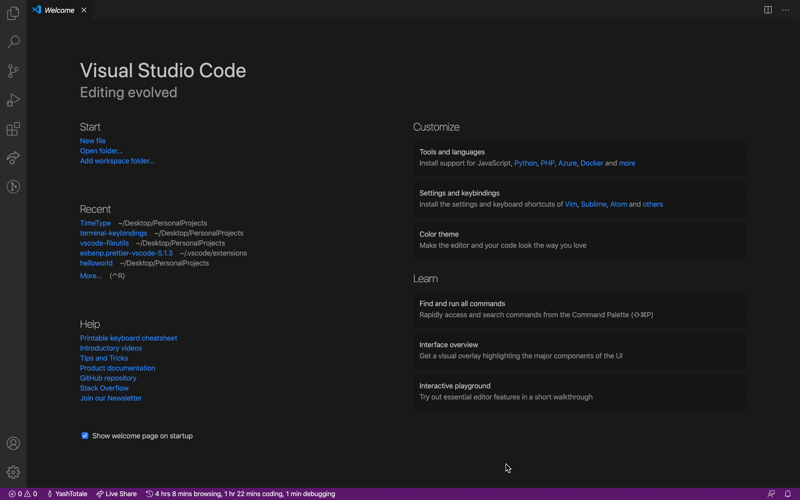
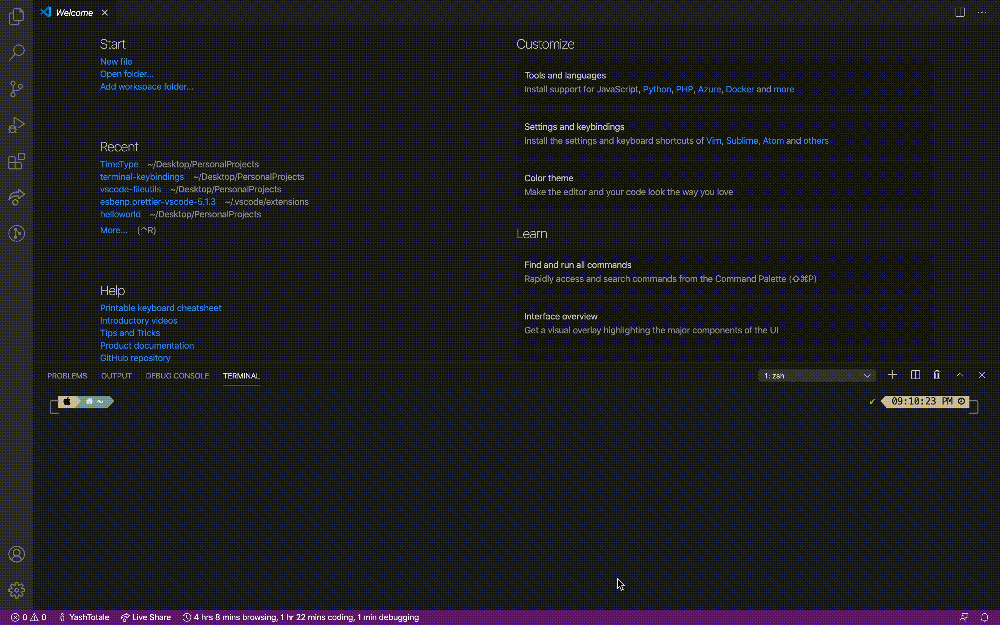
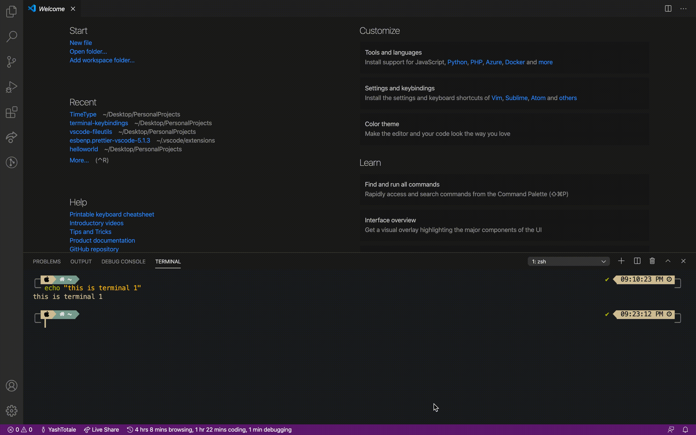

<h1 align="center">
   
    
   
   
  Terminal All In One
   
   
  <!-- Version -->
  
</h1>

  <!-- Rating -->
  
  &nbsp;
  <!-- Dependencies -->
  
  &nbsp;
  <!-- Build -->
  
  &nbsp;
  <!-- Vulnerabilities -->
  
  &nbsp;

**Table Of Contents**

- [Installation](#installation)
- [Usage](#usage)
  - [Mac](#mac)
  - [Windows and Linux](#windows-and-linux)
- [Demos](#demos)
- [Contribute](#contribute)

---

## Installation

1. Open [Terminal All In One - Visual Studio Marketplace](https://marketplace.visualstudio.com/items?itemName=yasht.terminal-all-in-one)
2. Click "Install"

OR

1. Open [Visual Studio Code](vscode:extension/yasht.terminal-all-in-one)
2. Open the Extensions View -> (`Shift+Cmd+P` or `F1` and type "Extensions: Install Extensions") or (`Shift+Cmd+X`)
3. Type "Terminal All In One"
4. Click "Install"

OR

1. Open a command-line prompt
2. Run `code --install-extension yasht.terminal-all-in-one`

---

## Usage

**For each keybinding, press `cmd+i` (for Macs) or `ctrl+i` (for Windows & Linux), and the corresponding key for the terminal action.**

### Mac

| Shortcut    | Description                          | Command                                        |
| ----------- | ------------------------------------ | ---------------------------------------------- |
| `` cmd+` `` | Toggle the Terminal                  | `workbench.action.terminal.toggleTerminal`     |
| `cmd+i m`   | Toggle the Maximized Terminal        | `terminalAllInOne.toggleMaxTerm`               |
| `cmd+i s`   | Select a Default Shell               | `workbench.action.terminal.selectDefaultShell` |
| `cmd+i c`   | Create a New Terminal Instance       | `workbench.action.terminal.new`                |
| `cmd+i d`   | Remove the Current Terminal Instance | `workbench.action.terminal.kill`               |
| `cmd+i r`   | Rename the Current Terminal Instance | `workbench.action.terminal.rename`             |
| `cmd+i .`   | Focus the Next Terminal Instance     | `workbench.action.terminal.focusNext`          |
| `cmd+i ,`   | Focus the Previous Terminal Instance | `workbench.action.terminal.focusPrevious`      |

### Windows and Linux

| Shortcut     | Description                          | Command                                        |
| ------------ | ------------------------------------ | ---------------------------------------------- |
| `` ctrl+` `` | Toggle the Terminal                  | `workbench.action.terminal.toggleTerminal`     |
| `ctrl+i m`   | Toggle the Maximized Terminal        | `terminalAllInOne.toggleMaxTerm`               |
| `ctrl+i s`   | Select a Default Shell               | `workbench.action.terminal.selectDefaultShell` |
| `ctrl+i c`   | Create a New Terminal Instance       | `workbench.action.terminal.new`                |
| `ctrl+i d`   | Remove the Current Terminal Instance | `workbench.action.terminal.kill`               |
| `ctrl+i r`   | Rename the Current Terminal Instance | `workbench.action.terminal.rename`             |
| `ctrl+i .`   | Focus the Next Terminal Instance     | `workbench.action.terminal.focusNext`          |
| `ctrl+i ,`   | Focus the Previous Terminal Instance | `workbench.action.terminal.focusPrevious`      |

---

## Demos

<!-- Toggle the Terminal -->

Toggle the Terminal

 

<!-- Toggle the Maximized Terminal -->

Toggle the Maximized Terminal

 

<!-- Select a Default Shell -->

Select a Default Shell

 

<!-- Create a New Terminal Instance-->

Create a New Terminal Instance

 

<!-- Remove the Current Terminal Instance -->

Remove the Current Terminal Instance

 

<!-- Rename the Current Terminal Instance -->

Rename the Current Terminal Instance

 

<!-- Focus the Next Terminal Instance -->

Focus the Next Terminal Instance

 

<!-- Focus the Previous Terminal Instance -->

Focus the Previous Terminal Instance

---

## Contribute

**Would you like to contribute?**

- Go to the [github repository](https://github.com/YashTotale/terminal-all-in-one)
- Open a new issue or pull request

_Check out [first contributions](https://github.com/firstcontributions/first-contributions) if you are new to contributing_

---

<!-- Downloads -->
  
  &nbsp;
<!-- Installs -->
  
  &nbsp;

---

<!-- Last Commit -->
  
  &nbsp;
<!-- Dev Dependencies -->

&nbsp;

---

<!-- Top Language -->
  
  &nbsp;
<!-- License -->
  
  &nbsp;

---

<!-- Keywords -->
  
  &nbsp;

---
